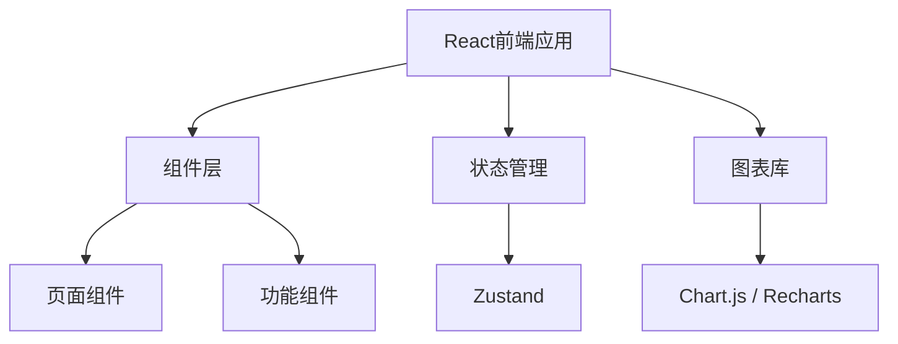
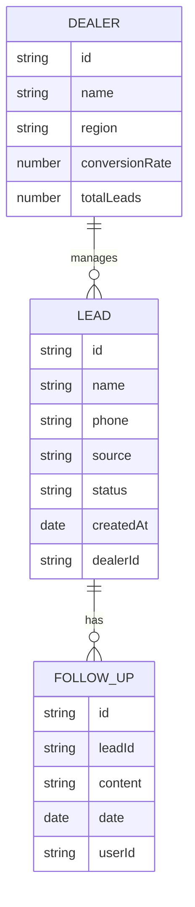

## 1. Architecture Design
线索运营监控系统采用前端单页应用架构，使用React构建用户界面，数据存储在本地状态中，便于快速原型开发和演示。

## 2. Technology Description
- Frontend: React@18 + TypeScript + tailwindcss@3 + vite
- Initialization Tool: vite-init
- Backend: None（前端原型，使用模拟数据）
- Database: None（使用本地状态和模拟数据）
- 状态管理: zustand
- 图表库: recharts

## 3. Route Definitions
| Route | Purpose |
|-------|---------|
| / | 系统主页（首页） |
| /leads | 线索管理页面 |
| /follow-up | 跟进记录页面 |
| /analytics | 数据分析页面 |
| /dealers | 经销商管理页面 |

## 4. API Definitions (if backend exists)
本项目暂时不涉及后端API，使用模拟数据进行演示。

## 5. Server Architecture Diagram (if backend exists)
本项目暂时不涉及后端服务。

## 6. Data Model (if applicable)
### 6.1 Data Model Definition

### 6.2 Data Definition Language
本项目暂时不涉及数据库，使用TypeScript类型定义数据结构。
