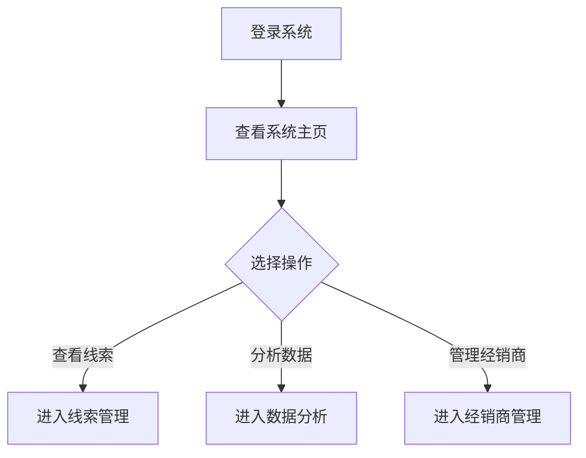

## 1. Product Overview
线索运营监控系统是车企销售业务管理的核心工具，帮助管理者实时掌握销售线索全流程运营情况，提升经销商线索转化率和运营效率。
- 面向车企销售业务管理者，提供关键数据可视化和功能导航
- 核心价值在于通过数据洞察优化线索分配、跟进和转化流程

## 2. Core Features

### 2.1 User Roles (if applicable)
| Role | Registration Method | Core Permissions |
|------|---------------------|------------------|
| 销售业务管理者 | 内部账号登录 | 查看全部数据、访问所有功能模块 |

### 2.2 Feature Module
1. **系统主页**：关键指标展示、快速导航、数据概览卡片
2. **线索管理**：线索列表、线索详情、线索分配
3. **跟进记录**：跟进历史、跟进任务、提醒设置
4. **数据分析**：转化率分析、渠道分析、经销商排名
5. **经销商管理**：经销商列表、经销商详情、绩效指标

### 2.3 Page Details
| Page Name | Module Name | Feature description |
|-----------|-------------|---------------------|
| 系统主页 | 顶部导航栏 | 系统logo、用户信息、通知中心 |
| 系统主页 | KPI指标卡片 | 展示今日新增线索、待跟进线索、本月转化量、转化率等核心指标 |
| 系统主页 | 数据趋势图表 | 线索来源趋势、转化趋势可视化 |
| 系统主页 | 功能导航区 | 快捷卡片导航至线索管理、数据分析、经销商管理等页面 |
| 系统主页 | 经销商排行榜 | 展示各经销商线索转化绩效排名 |

## 3. Core Process
销售业务管理者登录系统后，首先在主页查看核心KPI指标和数据趋势，通过功能导航进入具体业务模块进行操作。

## 4. User Interface Design
### 4.1 Design Style
- 主色调：深蓝色(#1e3a8a)，体现专业和稳重
- 辅助色：橙色(#f59e0b)用于强调关键数据，绿色(#10b981)表示增长
- 按钮风格：圆角矩形，有轻微阴影，悬停时有上浮效果
- 字体：Inter 作为主要字体，清晰易读
- 布局风格：卡片式布局，顶部导航 + 内容网格
- 图标风格：简约线性图标，使用 Lucide 图标库

### 4.2 Page Design Overview
| Page Name | Module Name | UI Elements |
|-----------|-------------|-------------|
| 系统主页 | KPI指标卡片 | 4个并排卡片，包含指标名称、数值、环比变化、趋势小图表 |
| 系统主页 | 数据趋势图表 | 左侧柱状图（线索来源），右侧折线图（转化趋势） |
| 系统主页 | 功能导航区 | 6个功能卡片，带图标和描述，悬停放大效果 |
| 系统主页 | 经销商排行榜 | 表格形式，带排名、经销商名称、转化量、转化率 |

### 4.3 Responsiveness
- 桌面端优先设计，适配1920×1080及以上分辨率
- 平板端自适应布局，卡片自动换行
- 移动端堆叠布局，优化触控操作

### 4.4 3D Scene Guidance (if applicable)
本项目不涉及3D场景
