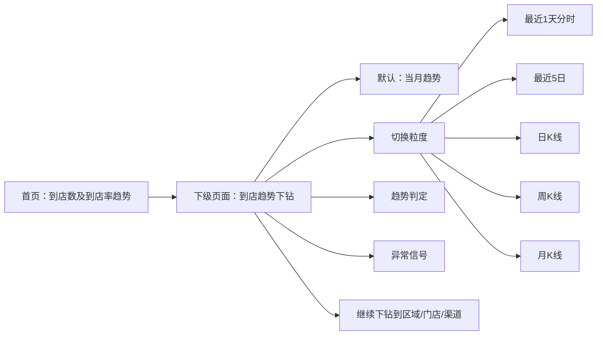

# 到店趋势下钻页面 PRD

> 版本：V1.0  
> 场景：线索运营监控系统首页「到店数及到店率趋势」下钻页  
> 目标用户：线索运营负责人、大区管理者、门店运营负责人

## 一、背景

首页现有「到店数及到店率趋势」只能看到一个固定口径的趋势图，适合快速扫一眼，但不足以支撑管理动作。

管理者真正需要的是：

1. 先看当月到店趋势是否正常。
2. 再像看股市大盘一样，快速切换到更短或更长的周期。
3. 通过分时、5日、日K、周K、月K判断趋势是正常波动，还是已经出现异常走弱。
4. 一旦异常，能继续下钻到区域、门店、渠道层级定位原因。

## 二、目标

### 2.1 产品目标

- 新增首页趋势卡片的下级页面。
- 默认展示当月到店数趋势。
- 支持切换 1 天分时、5 日、日 K、周 K、月 K。
- 让管理者在同一页面完成“看趋势 - 判断是否正常 - 继续下钻”的动作。

### 2.2 业务目标

- 让管理者更快识别到店节奏是否偏离正常区间。
- 降低“只看单点数值、看不出趋势变化”的误判。
- 统一趋势观察方式，减少线下沟通中对口径的解释成本。

## 三、页面定位

这不是一个普通报表页，而是一个“趋势判读页”。

它的定位更接近股票行情页：

- 默认先看当月趋势。
- 允许切换不同时间粒度。
- 通过趋势形态判断强弱。
- 通过异常信号引导管理动作。

## 四、信息架构

## 五、页面结构

### 5.1 顶部区

- 页面标题：到店趋势下钻
- 返回首页按钮
- 刷新按钮
- 最近同步时间

### 5.2 概览区

4 张指标卡：

| 卡片 | 含义 |
| :--- | :--- |
| 当前到店数 | 当前粒度下最新点位的到店数 |
| 当前到店率 | 当前粒度下最新点位的到店率，分母取首页中的新增经销商线索，不取月度新增总线索 |
| 峰谷差 | 当前周期内最大值 - 最小值 |
| 健康判定 | 正常 / 需要关注 / 异常偏弱 |

### 5.3 主图区

根据粒度切换不同图形：

| 粒度 | 图形表达 | 默认用途 |
| :--- | :--- | :--- |
| 当月趋势 | 日级折线 + 面积图 | 看月内节奏 |
| 最近1天分时 | 分时折线 | 看当天节奏 |
| 最近5日 | 短周期折线 | 看短线修复 |
| 日K线 | K线 + 到店率辅助线 | 看当天节奏，判断低开、回补、尾盘拉升 |
| 周K线 | K线 + 到店率辅助线 | 看一周经营节奏，判断本周是否偏弱 |
| 月K线 | K线 + 到店率辅助线 | 看月度推进节奏，判断目标是否按节拍推进 |

### 5.4 辅助判读区

- 趋势判定
- 异常信号
- 可切换粒度说明

## 六、交互设计

### 6.1 粒度切换

顶部使用 segmented tabs。

规则：

- 默认选中「当月趋势」。
- 切换后主图立即刷新，不跳页。
- 图例、标题、判定文案同步变化。

### 6.2 K线表达

K线采用股票式表达，但解释要贴近运营业务，不直接照搬证券术语：

- Open：周期起点
- High：周期最高点
- Low：周期最低点
- Close：周期终点

颜色规则：

- Close >= Open：绿色
- Close < Open：红色

辅助线：

- 到店率以细线/副图方式展示，避免和到店数混轴干扰。

### 6.2.1 业务解释

| 视图 | 业务解释 | 运营人员更容易理解为 |
| :--- | :--- | :--- |
| 日K线 | 一天内不同时间段的到店节奏被压缩成一根K线 | 今天是低开、回补还是尾盘拉升 |
| 周K线 | 一周内每天的到店节奏被压缩成一根K线 | 本周是稳步推进还是已经偏弱 |
| 月K线 | 一个月内各周节奏被压缩成一根K线 | 月度目标是否按节拍推进 |

### 6.3 判定逻辑

建议采用“趋势 + 波动”双判断：

- 连续下行且跌幅超阈值：异常偏弱
- 正常波动但未脱离均值带：需要关注
- 站稳短期均值且走势回升：正常

## 七、图形表达原则

1. 默认图形以“趋势判断”为主，不以装饰为主。
2. 到店数和到店率必须同屏出现。
3. 当前到店数和当前到店率采用浏览时的最新数据即可。
4. 到店率分母必须使用首页中的“新增经销商线索”，不能误写成月度新增总线索。
5. K线只用于结构判断，不替代明细分析。
6. 颜色保持克制，避免过度花哨。
7. 图表区域要能直接回答“现在正常不正常”。

## 八、数据建议

### 8.1 当月趋势

- 粒度：按天
- 指标：到店数、到店率
- 用途：月内节奏巡检

### 8.2 最近1天分时

- 粒度：按小时或半小时
- 指标：到店数、到店率
- 用途：看当天是否突然走弱或收盘拉升

### 8.3 最近5日

- 粒度：按天
- 指标：到店数、到店率
- 用途：看短线修复

### 8.4 日/周/月K

- 粒度：日、周、月
- 指标：开高低收、到店率辅助线
- 用途：像看业务节奏图一样看结构是否继续健康

## 九、页面验收标准

- 首页趋势卡片可进入下级页面。
- 默认进入即看到当月趋势。
- 可切换 1 天分时、5 日、日K、周K、月K。
- 主图、指标卡、判定文案同步联动。
- 用户能在 10 秒内判断趋势是正常、需要关注还是异常。

## 十、建议的实施顺序

1. 先上线页面壳和切换器。
2. 接入当月趋势数据。
3. 补齐 1 天分时与 5 日视图。
4. 再补 K 线视图与健康判定。
5. 最后接入区域/门店下钻。
