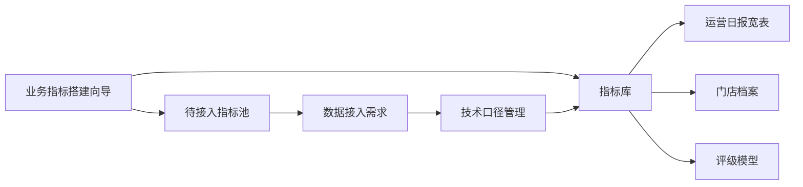
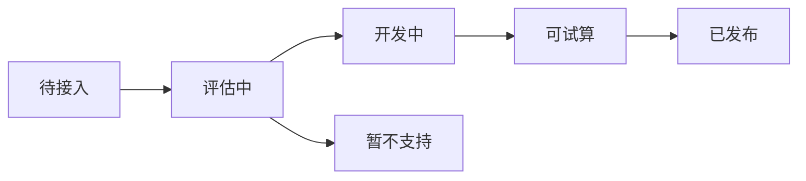

# 业务指标库与运营日报宽表建设 PRD

> 文档版本：V0.1  
> 创建日期：2026-05-24  
> 适用系统：线索运营监控系统  
> 关联原型：[业务指标搭建向导原型](../../prototypes/business-metric-wizard-prototype.html)

## 1. 背景

当前线索运营监控系统已有运营日报、门店档案、门店管理等能力。随着门店治理工作推进，运营人员需要不断新增指标，用于观察门店表现、解释门店长期问题、参与评级模型和治理策略。

现阶段的主要矛盾是：

- 指标新增往往依赖技术人员理解数据表、字段和计算逻辑。
- 运营人员更习惯用业务语言描述指标，例如“到店成交率”“连续异常门店”“近 7 天线索下降幅度”。
- 新指标不仅要出现在一个页面，还可能同时影响运营日报、门店档案和门店评级。
- 有些指标当前数据集市已经可以计算，有些指标还缺少数据来源，需要先形成数据接入需求。

因此，需要建设一套面向运营人员的业务指标搭建能力，并让运营日报逐步演进为可配置的大宽表。

## 2. 产品目标

本阶段目标是形成一套可确认、可逐步落地的指标建设方案：

- 运营人员可用业务语言创建指标，不直接配置 SQL 或底层字段。
- 系统能判断指标是否可直接计算，并给出样例试算结果。
- 不可计算的指标可保存为“待接入指标”，同时生成数据需求。
- 已发布指标可进入运营日报宽表、门店档案趋势、评级模型引用。
- 门店档案沉淀门店历史指标表现和人工治理结果。
- 门店管理继续承担治理状态、评级规则、人工备注等维护职责。

## 3. 产品边界

### 3.1 本阶段包含

- 业务指标搭建向导。
- 指标可计算性判断。
- 指标试算预览。
- 指标发布用途配置。
- 运营日报宽表字段来源方案。
- 门店档案指标展示方案。
- 评级模型引用指标方案。
- 待接入指标池与数据需求生成方案。

### 3.2 本阶段不包含

- 不直接上线真实计算引擎。
- 不直接改造现有运营日报生产链路。
- 不直接替换异常店治理工具现有工作流。
- 不在门店档案中维护治理信息。
- 不改变 `leads.db` 的源数据定位。

## 4. 用户角色

| 角色 | 主要诉求 |
|---|---|
| 运营人员 | 用业务语言新增指标，并看到指标是否能用于日报、档案和评级 |
| 运营管理者 | 维护指标启用范围，查看门店历史表现和治理结果 |
| 数据/技术人员 | 接收待接入指标的数据需求，维护底层字段和计算映射 |
| 系统管理员 | 管理指标权限、发布状态、评级模型配置 |

## 5. 总体功能结构

## 6. 指标创建流程

### 6.1 第一步：选择指标类型

运营人员先选择指标类型，不需要理解数据表。

支持类型：

| 类型 | 说明 | 示例 |
|---|---|---|
| 数量类 | 统计某类业务事件数量 | 线索量、到店数、成交数 |
| 比例类 | 两个指标相除 | 到店率、成交率、有效率 |
| 转化类 | 一个业务环节到另一个环节的转化 | 线索到店、到店成交 |
| 标签类 | 判断是否命中某个业务标签 | 是否重点店、是否治理中 |
| 风险类 | 识别风险或异常状态 | 高频问题店、连续异常店 |
| 趋势类 | 比较不同周期表现 | 近 7 天环比、近 30 天下滑幅度 |

### 6.2 第二步：定义业务口径

运营人员通过业务字段描述指标：

- 指标名称。
- 统计对象，例如门店、大区、战区。
- 指标方向，例如越高越好、越低越好、命中加分、命中扣分。
- 分子事件，例如成交数、到店数、跟进次数。
- 分母事件，例如线索数、到店数。
- 业务口径说明。

系统在后台将业务事件映射到底层数据来源，但不把底层表字段暴露给普通运营用户。

### 6.3 第三步：设置统计范围

支持配置：

- 统计周期：本日、本月、近 7 天、近 30 天、自定义周期。
- 渠道范围：线上、线下、全部渠道。
- 车型范围：全部车型、指定车型、车型组。
- 门店范围：全部门店、重点店、非重点店、指定组织范围。
- 空值处理：显示为空、按 0 计算、不参与评分。
- 刷新频率：随数据同步每日刷新、手动刷新、按小时刷新。

### 6.4 第四步：系统试算

系统根据当前数据能力进行判断：

| 判断结果 | 说明 | 后续动作 |
|---|---|---|
| 可直接计算 | 所需业务事件已有稳定数据来源 | 进入试算预览，可发布 |
| 需要生成派生指标 | 基础字段已有，但需要组合计算 | 保存计算规则后发布 |
| 需要数据接入 | 当前缺少稳定数据来源 | 保存为待接入指标 |

试算需要展示：

- 样例门店。
- 分子值。
- 分母值。
- 指标值。
- 异常说明，例如分母为 0、缺少数据。
- 样例覆盖率。

### 6.5 第五步：发布用途

同一个指标可以发布到多个使用场景。

支持用途：

- 进入运营日报宽表。
- 进入运营日报导出。
- 进入门店档案趋势。
- 允许评级模型引用。
- 仅保存为草稿。
- 保存为待接入指标。

## 7. 运营日报宽表方案

### 7.1 页面定位

运营日报从固定指标报表，逐步演进为“固定基础列 + 可配置指标列”的宽表。

### 7.2 字段组成

运营日报宽表由两类字段组成：

| 字段类型 | 来源 | 示例 |
|---|---|---|
| 固定基础字段 | 当前系统已有门店和组织信息 | 店编号、店简称、大区、战区、巡回员 |
| 动态指标字段 | 指标库中启用且勾选进入日报的指标 | 本月线索量、本月到店成交率、近 7 天线索环比 |

### 7.3 指标列展示规则

- 指标发布时可配置默认列名。
- 指标可配置是否进入页面展示、导出、筛选、排序。
- 暂不可计算的指标不进入正式日报宽表，只进入待接入池。
- 已禁用指标不再出现在新日报中，但历史结果可保留。

### 7.4 与现有日报的关系

第一阶段不强制替换现有运营日报口径，而是在现有基础上增加可配置指标能力。

原则：

- 现有核心日报指标保持稳定。
- 新指标先通过指标库发布进入宽表。
- 对影响业务判断的口径变更，需要保留版本记录。

## 8. 门店档案方案

### 8.1 页面定位

门店档案用于沉淀单店历史表现，是客观指标计算和人工治理结果的集中展示页。

### 8.2 展示内容

门店档案应展示：

- 门店基础信息。
- 历史日报趋势。
- 指标库发布到档案的指标趋势。
- 跟进历史。
- 原因分析。
- 治理状态和评级结果的只读展示。

说明：门店档案不承担治理信息编辑职责，避免与门店管理产生入口混淆。

### 8.3 指标展示规则

- 只有发布到“门店档案趋势”的指标才在档案中展示。
- 支持按日、周、月查看趋势。
- 支持查看指标口径说明。
- 支持标记指标异常，例如分母为 0、数据缺失、待接入。

## 9. 门店管理与评级方案

### 9.1 门店管理定位

门店管理用于维护人工治理信息和配置规则，不直接承载历史指标分析。

主要职责：

- 维护治理状态。
- 维护管理员备注。
- 配置门店状态候选值。
- 配置评级模型。
- 查看评级结果。

### 9.2 门店状态

这里的“门店状态”指本系统内独立维护的治理类状态，不与 `leads.db` 中的源表门店状态绑定。

配置能力：

- 新增状态。
- 启用状态。
- 禁用状态。
- 设置排序。
- 设置说明。

建议在页面文案中区分：

- 源表门店状态：来自 `leads.db`，只读。
- 治理状态：本系统维护，可配置、可编辑。

### 9.3 评级模型

评级应设计为可扩展的综合模型，由多个指标共同组成。

评级模型支持：

- 选择指标库中的指标。
- 配置权重。
- 配置得分规则。
- 配置分档规则。
- 配置生效版本。
- 查看评级解释。

示例：

| 维度 | 指标 | 方向 | 权重 |
|---|---|---|---|
| 线索表现 | 本月线索量 | 越高越好 | 25% |
| 到店表现 | 本月到店率 | 越高越好 | 25% |
| 成交表现 | 到店成交率 | 越高越好 | 30% |
| 治理标签 | 是否重点店 | 命中加权 | 20% |

评级结果可在门店管理中维护和查看，也可在门店档案中只读展示。

## 10. 待接入指标池

### 10.1 产生场景

当运营新增指标时，如果系统发现当前数据集市无法稳定计算，则自动保存为待接入指标。

例如：

- 运营想新增“试驾成交率”。
- 当前系统没有稳定的试驾数字段。
- 系统提示“需要数据接入”。
- 保存后生成数据需求。

### 10.2 数据需求内容

自动生成的数据需求包括：

- 指标名称。
- 业务定义。
- 所需业务事件。
- 建议数据粒度。
- 关联主键，例如店编号、日期。
- 期望用途，例如运营日报、门店档案、评级模型。
- 提出人。
- 提出时间。
- 当前状态。

### 10.3 状态流转

## 11. 权限设计

| 权限 | 能力 |
|---|---|
| metric_view | 查看指标库和指标口径 |
| metric_create | 创建指标草稿 |
| metric_publish | 发布指标到日报、档案、评级 |
| metric_admin | 管理技术映射、禁用指标、版本回滚 |
| store_management | 维护治理状态、备注和评级配置 |

## 12. 验收标准

- 运营人员可以通过业务语言完成一个新指标定义。
- 系统可以展示该指标是否可直接计算。
- 可计算指标可以看到样例试算结果。
- 不可计算指标可以保存为待接入指标，并生成数据需求。
- 发布到运营日报的指标，可以被识别为日报宽表动态列。
- 发布到门店档案的指标，可以被识别为档案趋势指标。
- 发布到评级模型的指标，可以被评级配置引用。
- 门店档案不提供治理信息编辑入口。
- 门店管理继续作为治理状态和评级配置的维护入口。

## 13. 分阶段实施建议

### 第一阶段：原型确认

- 确认业务指标搭建向导交互。
- 确认运营日报宽表字段使用方式。
- 确认门店档案与门店管理的职责边界。
- 确认待接入指标池是否符合运营协作流程。

### 第二阶段：指标元数据表

- 建立指标定义表。
- 建立指标发布用途表。
- 建立待接入指标表。
- 建立指标版本记录。

### 第三阶段：运营日报宽表接入

- 支持从指标库读取已启用指标。
- 支持按指标配置生成日报动态列。
- 支持导出动态指标列。

### 第四阶段：门店档案和评级接入

- 门店档案读取指标历史值。
- 评级模型引用指标库指标。
- 展示评级解释和指标贡献。

## 14. 待确认问题

- 指标发布是否需要审批流。
- 指标是否需要区分“个人草稿”和“全局指标”。
- 评级模型是否允许多个版本同时存在。
- 待接入指标的数据需求由谁负责接收和关闭。
- 运营日报宽表是否需要支持用户自定义列顺序。
